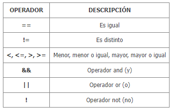

# GUIA DE JAVA
Para comenzar con un "hola mundo" hacemos lo siguiente
```java
    public static void main(String[] args) {
        System.out.println("HOLA PIBE"); 
    }

```
>Hay que saber que la clase principal, donde vamos a escribir nuestro proyecto es la que dice **main**

## VARIABLES
Tenemos las variables de tipo **Entero**, donde podemos encontrar

| Nombre | Tamaño | Rango 
|--------|--------|-------
| long   | 64     | Numero muy grande
| int    | 32     | -2,147,483,648 a 2,147,483,647
| short  | 16     | -32,768 a 32,767
| byte   | 8      | -128 a 127

Variables de tipo **Reales**

| Nombre | Tamaño | Rango 
|--------|--------|-------
| double | 64     | 4.9e-324 a 1.8e+308
| float  | 32     | 1.4e-045 a 3.4e+038

Por ultimo tenemos a:  
**Boolean** que solo acepta *True* o *False*

### **VARIABLES NO PRIMITIVAS**
Recien vimos unos tipos de variables, las cuales son no primitivas.  
Ahora vamos a ver cuales  son las primitivas, y una diferencia que podemos encontrar en estas es que las Primitivas aceptan el ***null*** mientras que las no primitivas no lo reconocen.    
**Integer**: Numero entero  
**String**: Cadena de texto/conjunto de caracteres(*Char*) 

> algo muy importante de los datos primitivos es que estos cuentan con Metodos, los cuales son eseciales para trabajar sobre los mismos.


## COMO DECLARAR VARIABLES
Esto es bastante parecido a pascal, pero lo diferencia es que hacemos todo en el mismo codigo.
```java
String nombre1 = "Palabra";
byte nombre2 = 4;    
```
> Aqui declaramos una variable "nombre1" de tipo *String* y una variable "nombre2" de tipo *byte*

## CONSTANTES
Estas se declaran como las variables, a diferencia que estas tienen una palabra representativa al inicio
```java
final String nombre1 = "Palabra";    
```

## ENTRADA Y SALIDA DE DATOS POR CONSOLA
Con esto podremos ingresar datos brindados por el usuario y hacer lo que sea con los mismos.  
Primero debemos declarar una clase, la cual nos permite hacer eso
```java
    Scanner nombreScanner = new Scanner(System.int);
    byte nombre_int;

    System.out.print("Ingrese un numero entero: ");
    nombre_int = nombreScanner.nextInt();
```
>Dependiendo el tipo de variable puede cambiar. por ejemplo, con un tipo de dato *float*  ponemos `.nextFloat()` y con *String* ponemos `.nextLine()`   

Aqui creamos un programa que le pide ingresar un numero al usuario y lo almacena en "nombre_int" 

## ENTRADA Y SALIDA DE DATOS POR JOPTIONPANE
Con JOptionPane, nosotros podremos tomar datos del usuario mediante una ventana emergente y,a su vez, mostrar esos datos.
```java
    String cadena;
    int numero;
    char letra;

    cadena = JOptionPane.showInputDialog("Ingrese una cadena: ");
    numero = Integer.parseInt(JOptionPane.showInputDialog("Ingrese una cadena: "));
    letra = JOptionPane.showInputDialog("Ingrese una cadena: ").charAt(0);

    // El JOptionPane.showInputDialog() almacena los datos en formato String. Por lo tanto debemos trabajar su almacen dependiendo el tipo de dato

```
> Para usar el JOptionPane se requiere de una libreria, pero JetBrains la importa automaticamente.

Si nosotros queremos generar una ventana emergente que muestre los datos ponemos
```java
    
    JoptionPane.showMessageDialog(null, "La cadena ingresada es "+cadena);
    JoptionPane.showMessageDialog(null, "La letra ingresada es "+letra);
    JoptionPane.showMessageDialog(null, "El numero ingresado es "+numero);

    // Podemos imprimir cualquier cosa en esas casillas

```

## CLASE MATH
Con la clase Math podemos realizar cualquier tipo de operacion matematica. Tiene muchas funciones, pero solo vamos a ver las mas utilizadas o mas basicas.


## OPERADORES LOGICOS
Con estos realizamos las operaciones de comparacion


> Estos son practicamente iguales a los de Javascript

> Tambien if/else son iguales a Javascript

## SWITCH
```java
    int edad;
    
    edad = Integer.parseInt(JOptionPane.showInputDialog("Ingrese su edad: "));

    switch(edad){
        case 18:
            // bloque de codigo
        break;
        case 19:
            // bloque de codigo
        break;
        case 20:
            // bloque de codigo
        break;
        default:
            // bloque de codigo
        break;        
    }

    // El default se ejecuta si no coincide con ninguno de arriba

```
Tambien existe otra forma de declararlo, y me lo marcaba JetBarains como la forma correcta. Es la siguiente
```java
    switch(edad){
        case 18 -> {
            // bloque de codigo
            }
        case 19 -> {
            // bloque de codigo
            }
        case 20 -> {
            // bloque de codigo
            }
        default -> {
            // bloque de codigo
        }
    }
```
## OPERADOR TERNARIO
Con este operador podemos darle un valor a una variable utilizando un condicional, y esto lo hacemos en una linea de codigo.
> Se escribe de igual manera que en JavaScript
```java
    String respuesta;
    int edad;

    respuesta= edad >= 18 ? "Podes pasar" : "No podes pasar";
```
> Trabaja de igual manera que un if y else. Solo que se toma el valor de ``?`` cuando la condicion es verdadera, y de ``:`` cuando la condicion es falsa.

## ARRAYS
Los arrays en Java se declaran al inicio del programa, con su respectivo tamaño y el tipo de dato que acepta.
Es parecido a pascal, pero con una particularidad. Su forma de escribirlo es asi:

#### **Tipo_de_variable[] Nombre_del_array = ***new*** Tipo_de_variable[ Dimension ]**

En java quedaria de la siguiente manera:
```java
int[] edades = new int[5]   //Array de tipo int con tamaño 5 [0..4]
```
> Van del 0 al numero indicado, no es como en pascal que lo podes definir vo. Automaticamente es  ``0..n-1``

---
Algo a tener en cuenta, es que en java, a diferencia de pascal, podemos elegir de forma dinamica el numero de elementos del array, ya que en java podemos declarar las variables en cualquier lugar. Un ejemplo para hacer esto es el siguiente:
```java
int elementos;
elementos = Integer.parseInt(JOptionPane.showInputDialog("Digite la cantidad de elementos del array:"))

int[] edades = new int[elementos]  

 //Dependiendo de los datos ingresados por el usuario, ese sera el tamaño del array
```

Tambien podemos declarar arrays con valores ya agregados. Asi:
```java
String[] nombres = { "Juan","Hernan","Luis","Miguel" }  
//Se crea un array de tipo String y de demension 4 [0..3] con los valores ya declarados.
```

## FOREACH
Para declarar el Bucle FOREACH se hace de una forma extraña
```java
String[] nombres = { "Juan","Hernan","Luis","Miguel" }  

for(String i:nombres){
    System.out.println(i) 
    //1er vuelta imprime "Juan" 2da:"Hernan" ....
}
```
> Es como que I toma el valor de ``nombres[i]``